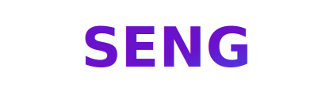

<div align="center">
  
</div>

<div align="center">
  
</div>

<p align="center">
  <a href="https://git.io/typing-svg">
    
  </a>
</p>

<div align="center">
  
  
  
</div>

<div align="center">
  <br>
  
  
</div>

---

<h2 align="center">📖 About seng</h2>

**seng** (Simple English) is a programming language designed so that even non-programmers can read, write, and understand code. Its syntax is plain English, focusing on the **logic** of your thoughts rather than the **syntax** of the machine.

<details open>
<summary><b>🌎 Mission & Vision</b></summary>
<br>

- **🧩 Ideology**: Programming is a human right. We focus on computational thinking without abstract symbol barriers.
- **🎯 Mission**: Zero-friction entry point into software development for educators and self-learners.
- **🔭 Vision**: Natural language as the global standard for introductory programming and AI automation.
- **💻 Supported Platforms**: Windows 🪟 & Linux 🐧
</details>

---

<h2 align="center">🚀 Quick Start</h2>

```sh
# Run a source file directly
seng hello.se

# Compile to bytecode
seng compile hello.se      # → creates hello.sec

# Run compiled bytecode
seng run hello.sec
```

---

<h2 align="center">🛠️ Language Reference</h2>

<details>
<summary><b>📝 Basics (Variables, Printing, Input)</b></summary>

```seng
# Variables
set name to "Alice"
set age to 25

# Printing
say "Hello, " + name

# Input
ask yourName for "What is your name? "
say "Hello, " + yourName
```
</details>

<details>
<summary><b>🔢 Arithmetic & Logic</b></summary>

```seng
set x to 10 plus 5        # 15
set x to 4 * 6            # 24
set x to 17 mod 3         # 2

if age is greater than 18 and age is less than 65 then
    say "Adult"
end
```
</details>

<details>
<summary><b>🔁 Control Flow (Loops & If)</b></summary>

```seng
# If / Else
if score is greater than 90 then
    say "A grade"
else
    say "Try harder"
end

# Loops
repeat 5 times
    say "Hello!"
end

while count is less than 10
    set count to count plus 1
end
```
</details>

<details>
<summary><b>📦 Functions & Lists</b></summary>

```seng
# Functions
define greet with name
    say "Hello, " + name + "!"
end
call greet with "Alice"

# Lists
make list fruits
add "Apple" to fruits
say item 1 of fruits
```
</details>

<details>
<summary><b>🏛️ Object-Oriented Programming (Blueprints)</b></summary>

```seng
# Define a blueprint
create blueprint Person
    has name
    has age

    define init with n and a
        set name of me to n
        set age of me to a
    end

    define greet
        say "Hello, I am " + name of me
    end
end

# Create an instance
create instance of Person called p1 with "Alice" and 30
call greet of p1
```
</details>

---

<h2 align="center">👨‍💻 Meet the Developer</h2>

<div align="center">
  
</div>

```javascript
const KANAGARAJ = {
    location: "India 🇮🇳",
    role: "Fullstack Developer",
    currentFocus: "Building Web3 Future",
    skills: {
        languages: ["Dart", "JavaScript", "Java", "Kotlin"],
        frameworks: ["Flutter", "React", "Express"],
        databases: ["MongoDB", "Firebase"],
        tools: ["Git", "VS Code", "Figma"]
    },
    contact: "mkrcreations.dev@gmail.com"
};
```

<div align="center">
  <h3>🛠️ Tech Stack</h3>
  
</div>

<h2 align="center">🏆 Achievements & Trophies</h2>

<p align="center">
  
</p>

---

<h2 align="center">📊 Project & Profile Stats</h2>

<p align="center">
  
</p>

<p align="center">
  
  
</p>

---

<h2 align="center">🤝 Connect With Me</h2>

<p align="center">
  <a href="https://twitter.com/mr_kanagaraj_m">
    
  </a>
  <a href="https://www.linkedin.com/in/kanagaraj-m-b86439227/">
    
  </a>
  <a href="https://www.instagram.com/kanagaraj.m_mkr/">
    
  </a>
</p>

<div align="center">
  
</div>

<p align="center">
  <i>seng v1.0.0 — NoCorps.org built by KANAGARAJ-M</i>
</p>
