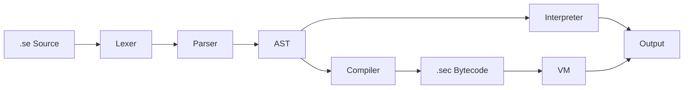

# seng Language — Implementation Summary

## Architecture



## Source Files (`src/`)

| File | Role |
|------|------|
| `common.h/c` | Memory helpers ([xmalloc](file:///c:/Users/kanag/Desktop/seng/src/common.h#16-22), [xstrdup](file:///c:/Users/kanag/Desktop/seng/src/common.h#32-39)), [read_file](file:///c:/Users/kanag/Desktop/seng/src/common.c#4-16), [fatal](file:///c:/Users/kanag/Desktop/seng/src/common.c#17-26) |
| `lexer.h/c` | Tokenizer — produces `Token` stream from source text |
| `ast.h/c` | AST node definitions + [node_new](file:///c:/Users/kanag/Desktop/seng/src/ast.c#12-18)/[node_free](file:///c:/Users/kanag/Desktop/seng/src/ast.c#21-60)/[node_list_push](file:///c:/Users/kanag/Desktop/seng/src/ast.c#4-11) |
| `parser.h/c` | Recursive-descent parser — produces `ND_PROGRAM` AST |
| `value.h/c` | Runtime values: `VAL_NUM`, `VAL_STR`, `VAL_BOOL`, `VAL_NULL`, `VAL_LIST`, `VAL_FUNC` with ref-counting |
| `env.h/c` | Hash-map variable environment with [env_update](file:///c:/Users/kanag/Desktop/seng/src/env.c#79-98) for mutation |
| `interp.h/c` | Tree-walk interpreter — [eval()](file:///c:/Users/kanag/Desktop/seng/src/interp.c#43-214) expressions, [exec()](file:///c:/Users/kanag/Desktop/seng/src/interp.c#225-399) statements |
| [bytecode.h](file:///c:/Users/kanag/Desktop/seng/src/bytecode.h) | Stack VM opcode enum + `.sec` file format spec |
| `compiler.h/c` | AST → bytecode compiler, writes `.sec` binary |
| `vm.h/c` | Stack-based virtual machine that reads and runs `.sec` files |
| [main.c](file:///c:/Users/kanag/Desktop/seng/src/main.c) | CLI entry point: `seng <file.se>`, `seng compile`, `seng run` |

## Language Syntax

### Statements
```seng
set x to 5                          # variable assignment
say "Hello " + x                    # print
ask name for "Prompt: "             # user input

if x is greater than 3 then        # conditional
    say "big"
else
    say "small"
end

repeat 5 times                      # fixed loop
    say "hi"
end

while x is less than 10            # conditional loop
    set x to x plus 1
end

define greet with name             # function definition
    say "Hello, " + name
end
call greet with "Alice"            # function call (statement)

give back value                    # return from function

make list items                    # list creation
add 42 to items                    # list append

import "utils.se"                  # file import

stop                               # break (loop)
skip                               # continue (loop)
```

### Expressions
```seng
result of funcName with arg1 and arg2   # function call (expression)
item 2 of myList                        # list access (1-indexed)
length of myList                        # list size
n times m                              # multiply (keyword)
n * m                                  # multiply (operator)
n divided by m                         # divide (keyword)
n plus m  /  n minus m                 # add/subtract (keywords)
n + m  /  n - m                       # add/subtract (operators)
n mod m / n % m                       # modulo
```

### Comparisons
```seng
x is equal to 5
x is not equal to 5
x is greater than 5
x is less than 5
x is greater than or equal to 5
x is less than or equal to 5
```

### Object-Oriented Programming (Full Support)
SENG supports blueprints, instances, and inheritance. OOP is implemented in both the interpreter and the Bytecode VM.

#### Blueprint & Inheritance
```seng
create blueprint Animal
    has name
    define init with n
        set name of me to n
    end
end

create blueprint Dog from Animal
    define speak
        say name of me + " barks: Woof!"
    end
end
```

#### Instantiation & Usage
```seng
create instance of Dog called myDog with "Buddy"
call speak of myDog
set name of myDog to "Max"
say name of myDog
```

## Key Design Decisions

> [!IMPORTANT]
> **Reference Semantics**: Blueprints and instances (as well as lists) use reference semantics. Assigning one instance to another variable does NOT create a copy; both variables point to the same object.

> [!NOTE]
> **`me` keyword**: Inside a blueprint method, `me` refers to the current instance. It can be used to access fields or call other methods on the same object.

> [!NOTE]
> **`init` method**: If a blueprint defines an `init` method, it will be automatically called when an instance is created via `create instance of ... with ...`.

## .sec Binary Format

```
[4 bytes] Magic: "SENG"
[1 byte]  Version: 1
[4 bytes] Constant pool count
  For each constant:
    [1 byte]  type (0=number, 1=string)
    [8 bytes] double  OR  [4 bytes len][N bytes string]
[4 bytes] Instruction count
  For each instruction:
    [1 byte]  opcode
    [4 bytes] int32_t operand
```

## Build

```sh
gcc -std=c99 -O2 -Isrc -o seng.exe src/*.c -lm
```

## Usage

```sh
seng hello.se              # interpret
seng compile hello.se      # → hello.sec
seng run hello.sec         # run bytecode
```
